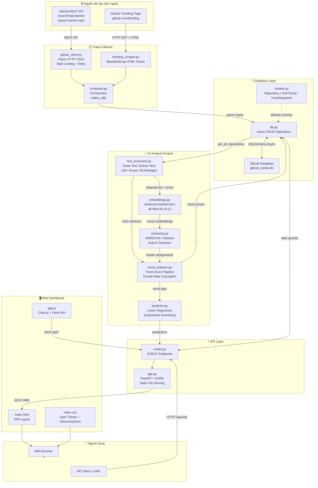

# Architecture — GitHub Tech Trends AI System

## Sơ đồ tổng quan hệ thống



---

## Service Communication Matrix

| Từ → Đến | Collector | Database | Analyzer | API | Dashboard |
|-----------|-----------|----------|----------|-----|-----------|
| **Collector** | — | ✅ upsert repos | — | — | — |
| **Database** | — | — | ✅ provide data | ✅ query results | — |
| **Analyzer** | — | ✅ read repos, write trends | — | — | — |
| **API** | ✅ trigger collect | ✅ query all tables | ✅ trigger analyze | — | ✅ serve static |
| **Dashboard** | — | — | — | ✅ fetch /api/* | — |

---

## Chi tiết từng Service

### 1. Data Collector (`collector/`)

```
┌─────────────────────────────────────────────┐
│ collector/scheduler.py                       │
│   collect_all()                              │
│     ├── collect_trending()                   │
│     │     └── TrendingScraper                │
│     │           └── scrape_all_trending()    │
│     │                 ├── GET github.com/trending/{lang}?since={period}
│     │                 └── BeautifulSoup parse HTML
│     └── collect_search()                     │
│           └── GitHubClient                   │
│                 ├── search_repositories()    │
│                 ├── search_recent_popular()  │
│                 └── get_readme()             │
│                       └── Base64 decode      │
└──────────────┬──────────────────────────────┘
               │ upsert_repositories()
               ▼
         ┌──────────┐
         │ Database  │
         └──────────┘
```

**Giao tiếp:**
- → GitHub API: `httpx.AsyncClient` (REST, JSON)
- → GitHub Trending: `httpx.AsyncClient` (HTTP GET, HTML)
- → Database: `database.db.upsert_repositories()` (SQLAlchemy async)

---

### 2. Database Layer (`database/`)

```
┌────────────────────────────────────────┐
│ database/db.py                          │
│   Engine: SQLite + aiosqlite           │
│   Session: async_sessionmaker          │
│                                        │
│   Repository CRUD:                     │
│     upsert_repository()               │
│     upsert_repositories()             │
│     get_repositories()                 │
│     get_all_repositories()             │
│                                        │
│   TechTrend CRUD:                      │
│     upsert_trend()                     │
│     get_trends()                       │
│     get_trend_by_name()                │
│     get_categories()                   │
│                                        │
│   TrendSnapshot CRUD:                  │
│     add_snapshot()                     │
│     get_trend_timeline()               │
└────────────────────────────────────────┘
               │
    SQLAlchemy async engine
               │
         ┌──────────┐
         │ SQLite DB │
         │ data/github_trends.db │
         └──────────┘
```

**3 Tables:**
- `repositories` — raw data từ GitHub
- `tech_trends` — xu hướng đã phân tích
- `trend_snapshots` — time-series data

---

### 3. AI Analysis Engine (`analyzer/`)

```
┌──────────────────────────────────────────────────────┐
│ analyzer/trend_analyzer.py :: analyze_trends()        │
│                                                       │
│ Pipeline:                                            │
│  1. get_all_repositories() ──────────────────────┐   │
│  2. extract_technologies(text, topics) ◄─────────┤   │
│     └── text_processor.py: 150+ known techs      │   │
│  3. prepare_text_for_embedding() ────────────┐   │   │
│  4. generate_batch(texts) ◄──────────────────┤   │   │
│     └── embeddings.py: sentence-transformers │   │   │
│  5. cluster_repositories(embeddings) ◄───────┘   │   │
│     └── clustering.py: HDBSCAN → KMeans fallback │   │
│  6. label_clusters(clusters, repo_techs)         │   │
│  7. _calculate_trend_score()                     │   │
│     └── 30% popularity + 25% mentions            │   │
│         + 25% recent activity + 20% repo count   │   │
│  8. upsert_trend() + add_snapshot() ─────────────┘   │
│                                                       │
│ analyzer/predictor.py :: predict_trends()             │
│  ├── Linear Regression (≥3 data points)              │
│  ├── Exponential Smoothing (1-2 data points)         │
│  └── Current Extrapolation (no timeline)             │
└──────────────────────────────────────────────────────┘
```

**Giao tiếp:**
- ← Database: đọc repos qua `get_all_repositories()`
- → Database: ghi trends qua `upsert_trend()`, `add_snapshot()`
- Internal: text_processor → embeddings → clustering → trend scoring

---

### 4. API Layer (`api/`)

```
┌────────────────────────────────────────────────┐
│ api/app.py                                      │
│   FastAPI(lifespan=...)                         │
│     startup: init_db()                          │
│     CORS: allow_origins=["*"]                   │
│     Static: /static → dashboard/                │
│     Route: / → serve index.html                 │
│                                                  │
│ api/routes.py                                    │
│   GET  /api/trends          → get_trends()      │
│   GET  /api/trends/detail/  → get_trend_by_name │
│   GET  /api/trends/timeline → get_trend_timeline│
│   GET  /api/categories      → get_categories()  │
│   GET  /api/predictions     → predict_trends()  │
│   GET  /api/repos           → get_repositories()│
│   GET  /api/stats           → aggregate stats   │
│   POST /api/collect         → collect_all()     │
│   POST /api/analyze         → analyze_trends()  │
└────────────────────────────────────────────────┘
```

**Giao tiếp:**
- ← Dashboard: nhận HTTP requests từ `app.js`
- → Database: query qua `db.py` functions
- → Collector: trigger qua `scheduler.py` (background task)
- → Analyzer: trigger qua `trend_analyzer.py` (background task)

---

### 5. Dashboard (`dashboard/`)

```
┌──────────────────────────────────────────────┐
│ dashboard/                                    │
│   index.html → SPA layout                    │
│   index.css  → Dark theme, glassmorphism     │
│   app.js     → Logic                         │
│                                               │
│   Data Flow:                                  │
│   loadAllData() ──┬── GET /api/stats          │
│                   ├── GET /api/trends          │
│                   ├── GET /api/categories      │
│                   ├── GET /api/predictions     │
│                   └── GET /api/repos           │
│                                               │
│   User Actions:                               │
│   btnCollect → POST /api/collect              │
│   searchInput → filter client-side            │
│   filterBtn → reload trends with category     │
│   trend-card click → GET /api/trends/detail/  │
│                                               │
│   Auto-refresh: setInterval(60s)              │
└──────────────────────────────────────────────┘
```

**Giao tiếp:**
- → API: `fetch()` calls tới `/api/*`
- Dependencies: Chart.js (CDN)

---

## Technology Stack

| Layer | Technology | Lý do chọn |
|-------|-----------|------------|
| Runtime | Python 3.11+ | Hệ sinh thái AI/ML phong phú |
| Web Framework | FastAPI | Async, auto-docs, type-safe |
| HTTP Client | httpx | Async, HTTP/2, connection pooling |
| Scraping | BeautifulSoup4 | Đơn giản, reliable cho HTML parsing |
| ORM | SQLAlchemy 2.0 | Async support, mature ecosystem |
| Database | SQLite + aiosqlite | Zero-config, file-based, đủ cho prototype |
| Embeddings | sentence-transformers | Local, không cần API key, model nhẹ |
| Clustering | HDBSCAN / scikit-learn | HDBSCAN tự detect clusters, KMeans fallback |
| Frontend | Vanilla JS + Chart.js | Nhẹ, không cần build step |
| Styling | Vanilla CSS | Full control, no runtime overhead |
